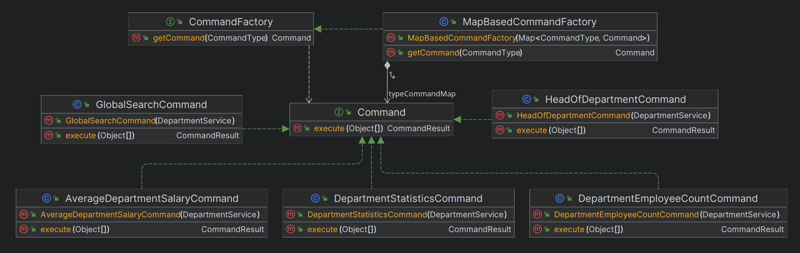

# University console - Spring Boot test task

**Junior / Strong Junior**

## Task

Create a simple Spring Boot java project with the console interface for university, which consists of departments and lectors. The lectors could work in more than one department. A lector could have one degree (assistant, associate professor, professor).

All data is stored in the relational database.  
Please send us a link to the GitHub repository with your version of this project.

### The app should implement such commands:

1. User Input: Who is head of department {department_name}

    Answer: Head of {department_name} department is {head_of_department_name}

2. User Input: Show {department_name} statistics.

    Answer: assistans - {assistams_count}.
associate professors - {associate_professors_count}
professors -{professors_count}

3. User Input: Show the average salary for the department {department_name}.

   Answer: The average salary of {department_name} is {average_salary}

4. User Input: Show count of employee for {department_name}.

   Answer: {employee_count}

5. User Input: Global search by {template}.   

   Example: Global search by van

   Answer: Ivan Petrenko, Petro Ivanov

## Implemented solution

### Example


### Running the app

This app relies on Spring Boot docker compose support, so you need docker to be installed to run this app.

To start the app run:
`mvn pring-boot:run` or use your IDE

To exit run: `exit`

### Database

Database structure


App database: PostgreSQL 15

Db container is run on startup via Spring Boot docker compose support

Db tables are created and filled with demo data on startup via Flyway migrations

### Command design

To fulfill the task, **Command design pattern** is applied.

Command class diagram


* There are 5 implementations of Command interface shown on the diagram.
* Each Command implementation relies on DepartmentService to execute its query
* To create Command objects **Abstract Factory design patter** is applied.

### Command parsing

Before obtaining the Command implementation instance, one needs to parse user input to know the type of command
to be used as well as its arguments. This information is contained in CommandDetails object.

Command parsing is performed via CommandParser. To implement parsing mechanism **Chain of Responsibility design 
pattern** is applied. The chain is built via **Builder design pattern**

CommandParser class diagram


CommandParserChain class is an implementation of CoR pattern. It is built and used as a singleton bean:
```
    @Bean
    public CommandParser commandParserChain() {
        return CommandParserChainBuilder
                .startChain(new AverageDepartmentSalaryCommandParser())
                .then(new DepartmentEmployeeCountCommandParser())
                .then(new DepartmentStatisticsCommandParser())
                .then(new GlobalSearchCommandParser())
                .then(new HeadOfDepartmentCommandParser())
                .build();
    }
```

The command is parsed by the first chain item capable of doing it. If chain cannot parse the command, 
UnknownCommandException is thrown.
